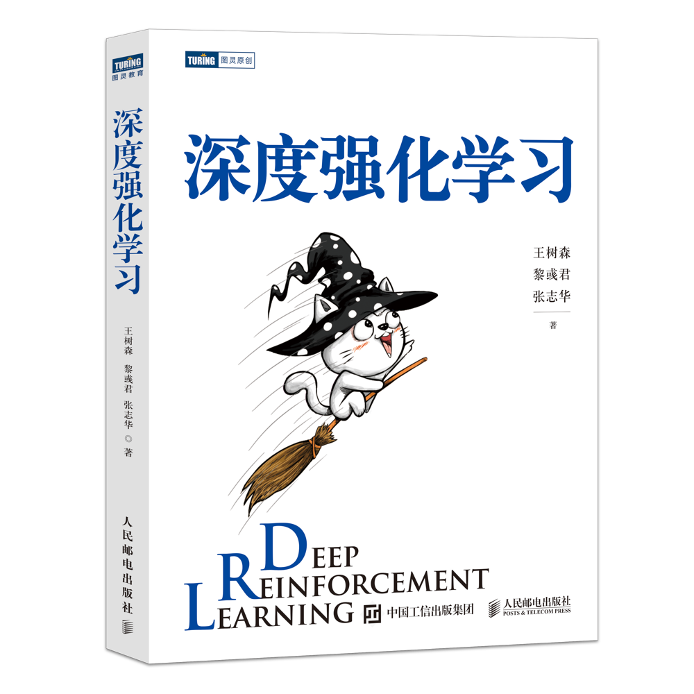
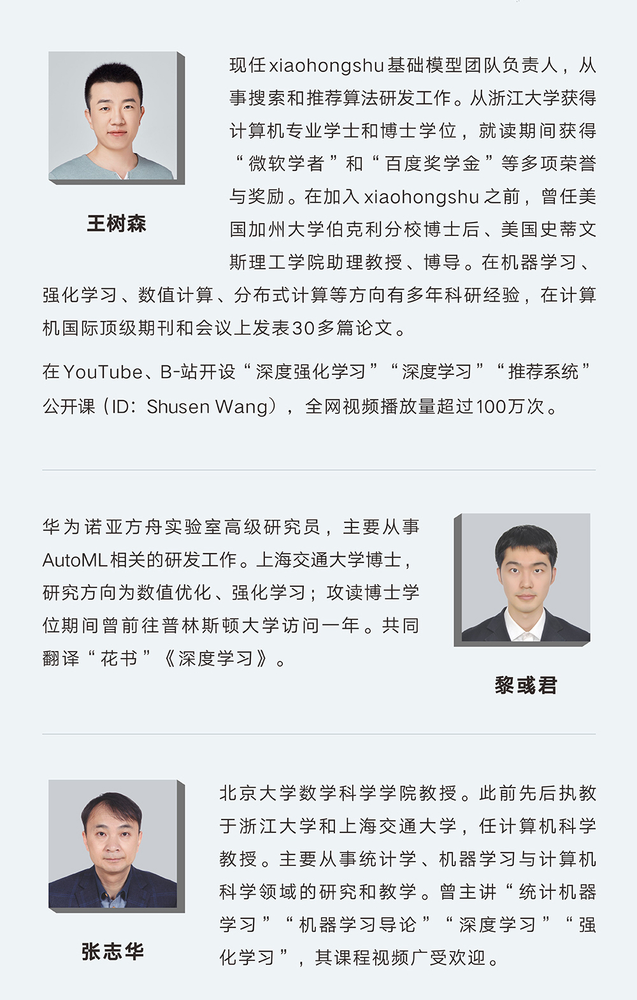

# Deep Reinforcement Learning Book In Chinese

中文图书[人民邮电出版社](https://www.ituring.com.cn/book/2982)编辑和出版，全书294页，彩色印刷。草稿仍然可以在我的GitHub上免费下载。正式出版的书经过了作者和编辑的反复修改和校对，并添加了少量新的内容、习题、以及全部习题的答案。本书算法的PyTorch代码在这里 [[链接]](https://github.com/DeepRLChinese/DeepRL-Chinese)。

京东：[https://u.jd.com/eLdsveg](https://u.jd.com/eLdsveg)

当当：[http://product.dangdang.com/29490069.html‍‬⁢‬‍‌⁢⁣](http://product.dangdang.com/29490069.html)

